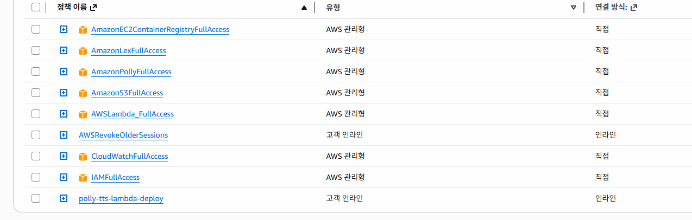
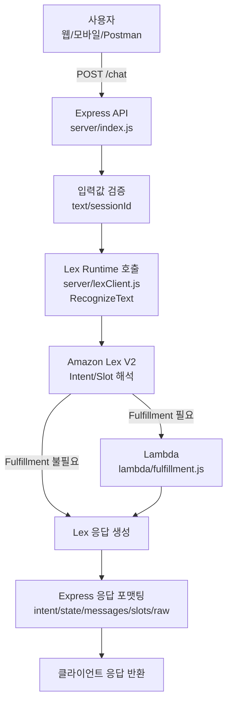
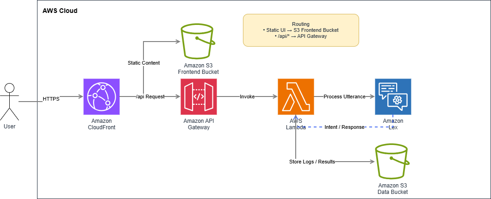

# Amazon Lex V2 + Node.js 실습 패키지 (학원 예약/상담 도메인)



이 레포는 **Amazon Lex V2 챗봇**을 구축하고, **Lambda Fulfillment(Node.js)** 및 **Express API 서버**를 통해
**Lex Runtime V2(RecognizeText)** 를 호출하는 전체 흐름을 실습하도록 구성되어 있습니다.

핵심 목표는 다음 3가지입니다.
- Lex V2 봇(인텐트/슬롯/로케일/앨리어스) 설계 및 빌드
- Lambda Fulfillment로 예약/조회/취소 대화 처리
- Node.js API(`/chat`)를 통한 외부 앱 연동 패턴 이해

---

## 1) 기술 스택

- **클라우드**: AWS Lex V2, AWS Lambda, IAM, CloudWatch
- **런타임/언어**: Node.js 18+, JavaScript(CommonJS)
- **SDK/CLI**:
  - AWS SDK for JavaScript v3 (`@aws-sdk/client-lex-runtime-v2`, `@aws-sdk/client-lex-models-v2`, `@aws-sdk/client-iam`, `@aws-sdk/client-sts`)
  - AWS CLI v2
- **서버**: Express
- **권장 리전**: `ap-northeast-2` (서울)

---

## 2) 프로젝트 구조와 역할

```text
.
├─ README.md                      # 프로젝트 전체 가이드(이 문서)
├─ docs/
│  ├─ lex-design.md               # 인텐트/슬롯 설계표 + 콘솔 체크리스트
│  └─ utterances-100.md           # Intent별 샘플 발화 100개
├─ lambda/
│  └─ fulfillment.js              # Lex Fulfillment Lambda 핸들러
├─ server/
│  ├─ index.js                    # Express API (/health, /chat)
│  ├─ lexClient.js                # Lex Runtime V2 RecognizeText 호출 래퍼
│  └─ package.json
├─ infra/
│  ├─ README.md                   # Lex 자동 생성 스크립트 사용법
│  ├─ config.example.env          # 자동 생성용 환경 변수 템플릿
│  ├─ lex-bootstrap.sh            # AWS CLI 기반 자동 생성 스크립트(bash)
│  ├─ lex-bootstrap.py            # AWS CLI 기반 자동 생성 스크립트(Python)
│  └─ lex-bootstrap.js            # AWS SDK 기반 자동 생성 스크립트
├─ scripts/
│  └─ seed-testcases.json         # 테스트 발화/기대 인텐트 시드
└─ postman/
   ├─ Lex-Lab.postman_collection.json
   └─ Lex-Lab.postman_environment.json
```

---

## 3) 런타임 아키텍처(요약)



1. 사용자가 클라이언트(웹/모바일/Postman)에서 `POST /chat` 호출
2. Express 서버(`server/index.js`)가 입력 텍스트를 검증
3. `server/lexClient.js`가 `RecognizeText`를 Lex Runtime V2에 전달
4. Lex가 의도(Intent)/슬롯(Slot)을 해석
5. Fulfillment가 필요한 인텐트면 Lambda(`lambda/fulfillment.js`) 실행
6. Lambda 응답(`sessionState`, `messages`)이 Lex를 통해 서버로 반환
7. 서버는 `intent`, `state`, `messages`, `slots`, `raw` 형태로 응답

---

## 4) AWS CLI 설정 (추가)

아래는 **로컬에서 이 프로젝트를 실행하기 위한 AWS CLI 기본 설정 절차**입니다.

### 4-1. AWS CLI 설치 확인

```bash
aws --version
```

### 4-2. 자격 증명 설정

#### 방법 A) 기본 프로파일 사용

```bash
aws configure
```

입력값 예시:
- AWS Access Key ID: `<YOUR_ACCESS_KEY_ID>`
- AWS Secret Access Key: `<YOUR_SECRET_ACCESS_KEY>`
- Default region name: `ap-northeast-2`
- Default output format: `json`

#### 방법 B) 별도 프로파일(`lexlab`) 사용

```bash
aws configure --profile lexlab
```

그리고 셸에서 프로파일 지정:

```bash
export AWS_PROFILE=lexlab
```

### 4-3. 자격 증명 유효성 검증

```bash
aws sts get-caller-identity
```

계정 ID/ARN이 정상 출력되면 인증 성공입니다.

### 4-4. 필수 권한(최소)

실습 계정/사용자(또는 역할)에 아래 권한이 필요합니다.
- `lex:RecognizeText` (런타임 호출)
- `lex:*` 또는 생성 스크립트에 필요한 Lex 모델 권한 (자동 생성 시)
- `lambda:InvokeFunction` (Lex ↔ Lambda 연동)
- `iam:CreateRole`, `iam:AttachRolePolicy`, `iam:PassRole` (자동 생성 스크립트로 역할 생성 시)

> 운영 환경에서는 최소 권한 원칙에 따라 세분화된 정책을 권장합니다.

---

## 5) 로컬 서버 실행

### 5-1. 의존성 설치

```bash
cd server
npm i
```

### 5-2. 환경 변수 설정

```bash
export AWS_REGION=ap-northeast-2
export LEX_BOT_ID=
export LEX_BOT_ALIAS_ID=
export LEX_LOCALE_ID=ko_KR
```

### 5-3. 서버 시작

```bash
node index.js
```

- 기본 포트: `3000`
- 헬스체크: `GET http://localhost:3000/health`
- 챗 엔드포인트: `POST http://localhost:3000/chat`

### 5-4. API 호출 예시

```bash
curl -s http://localhost:3000/chat \
  -H 'Content-Type: application/json' \
  -d '{"text":"강남점 토익 예약하고 싶어요","sessionId":"demo-user-001"}' | jq .
```

---

## 6) Lex 봇 준비 방법

### 방법 A) 콘솔 수동 구성

- `docs/lex-design.md`를 따라 인텐트/슬롯 생성
- 로케일: `ko_KR`
- 빌드 후 Alias(예: DEV) 생성
- Alias에 Lambda 코드훅 연결

### 방법 B) infra 스크립트 자동 구성

- `infra/config.example.env`를 `infra/config.env`로 복사 후 값 설정
- 아래 중 하나 실행
  - `python3 infra/lex-bootstrap.py` (AWS CLI, Python / 권장)
  - `bash infra/lex-bootstrap.sh` (AWS CLI, bash)
  - `node infra/lex-bootstrap.js` (AWS SDK)
- 생성 결과로 `BOT_ID`, `BOT_ALIAS_ID`를 받아 서버 환경변수에 반영

자동 생성 상세는 `infra/README.md` 참고.

---

## 7) 문서(`.md`) 상세 안내

### 7-1. `docs/lex-design.md`

이 문서는 **대화 모델 설계 기준서**입니다.
- 인텐트 목적/필수 슬롯/Fulfillment 연결 여부
- `BranchType`, `CourseType` 같은 커스텀 슬롯 타입 예시
- MakeReservation 슬롯 우선순위 설계 방향
- 콘솔 체크리스트(빌드, Alias, Lambda 권한, 로그)

즉, “어떤 봇을 어떻게 구성할지”에 대한 설계와 점검 항목을 제공합니다.

### 7-2. `docs/utterances-100.md`

이 문서는 **NLU 학습/검증용 샘플 발화 세트**입니다.
- MakeReservation / CheckReservation / CancelReservation / CourseInfo / Help
- 각 Intent별 20개, 총 100개 문장
- 콘솔 테스트 창 수동 검증 또는 대량 테스트 시나리오 작성에 유용

즉, “사용자가 실제로 어떻게 말할지”를 Intent별로 폭넓게 커버합니다.

### 7-3. `infra/README.md`

이 문서는 **인프라 자동 생성 실행 매뉴얼**입니다.
- CLI/SDK 두 방식의 실행 절차
- `config.env` 주요 설정값 설명
- 실행 완료 후 서버 연동 방법

즉, 콘솔 수작업 대신 스크립트로 재현 가능한 구축 절차를 제공합니다.

---

## 8) Lambda Fulfillment 배포 요약

`lambda/fulfillment.js`를 Lambda(Node.js 18+)에 배포하고,
Lex Alias에 Fulfillment 코드훅으로 연결합니다.

현재 Lambda 구현은 **데모 목적**으로 세션 속성(`sessionAttributes`)에 최근 예약 정보를 저장합니다.
운영에서는 DynamoDB/RDS 같은 영속 스토리지로 대체하는 것을 권장합니다.

---

## 9) Postman 테스트

`postman/`의 컬렉션/환경 파일을 import 후,
환경변수 `BASE_URL=http://localhost:3000` 설정 뒤 요청을 실행하세요.

---

## 10) 참고/주의사항

- 기본 로케일은 `ko_KR` 기준이며, 다국어 확장 시 로케일별 모델 분리를 권장합니다.
- Alias 기반(DEV/PROD) 배포 전략을 사용하면 안정적인 변경 반영이 가능합니다.
- Lambda/Express 로그를 CloudWatch 및 콘솔 로그로 함께 추적하면 문제 분석이 쉽습니다.

### AWS Infra Architecture



## API GW 기초 부터 붙여보기
```
arn:aws:lambda:ap-northeast-2:086015456585:function:LexReservationFulfillment
```
---
```
REGION=ap-northeast-2
LAMBDA_ARN="arn:aws:lambda:ap-northeast-2:086015456585:function:LexReservationFulfillment"

aws apigatewayv2 create-api \
  --region "$REGION" \
  --name "my-http-api" \
  --protocol-type HTTP \
  --target "$LAMBDA_ARN"
```
---
```
ACCOUNT_ID="086015456585"
API_ID="n67z2umjee"

aws lambda add-permission \
  --region "$REGION" \
  --function-name LexReservationFulfillment \
  --statement-id apigw-invoke \
  --action lambda:InvokeFunction \
  --principal apigateway.amazonaws.com \
  --source-arn "arn:aws:execute-api:${REGION}:${ACCOUNT_ID}:${API_ID}/*/*/*"
```
---
## 관련 문서 : https://chatgpt.com/share/69a0f811-9f40-8007-b939-1b963a13144e

---