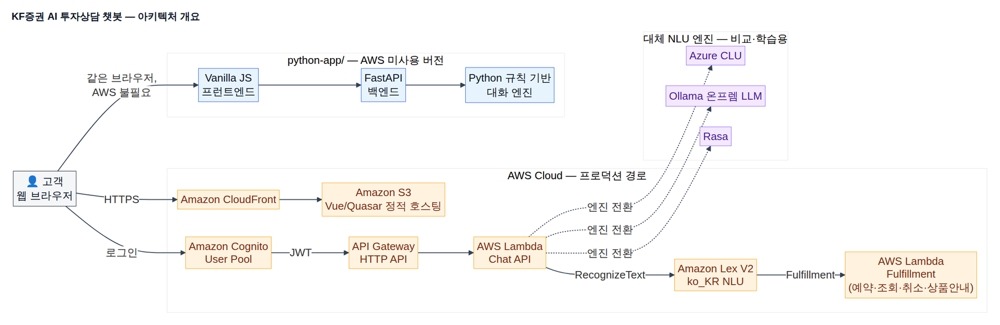
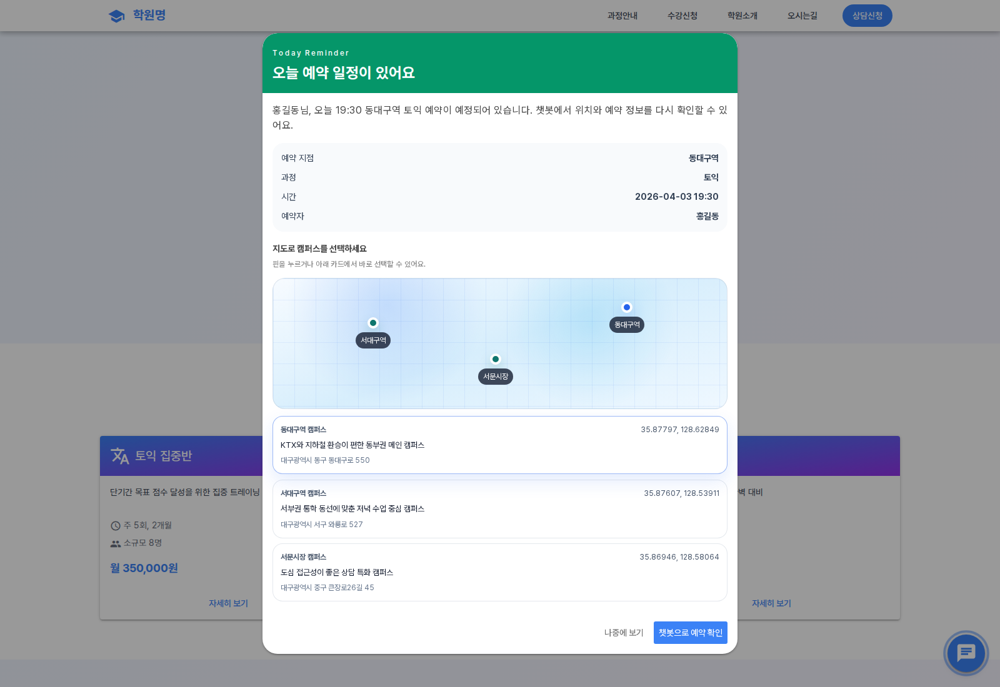
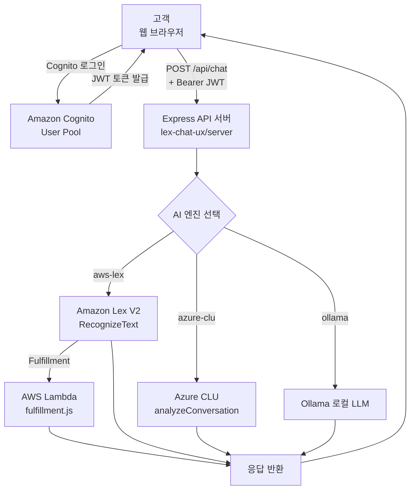
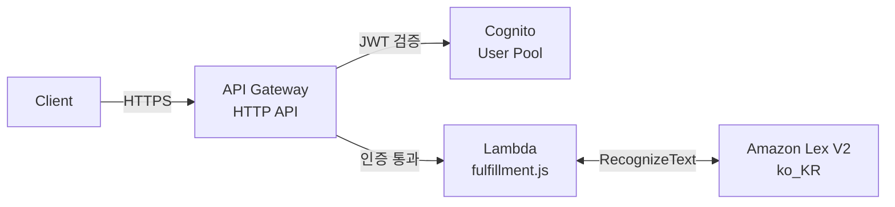

# KF증권 AI 투자상담 챗봇 플랫폼



## 프로젝트 개요

**KF증권** 홈페이지와 AI 투자상담 챗봇을 통합한 웹 애플리케이션입니다.

고객은 홈페이지에서 실시간 시세·금융상품 정보를 확인하고, AI 챗봇으로 지점 투자상담을 예약·조회·취소할 수 있습니다.
챗봇 엔진은 **Amazon Lex V2(AWS)**, **Azure CLU**, **Ollama 온프렘** 세 가지를 지원하며 환경변수 한 줄로 전환할 수 있습니다.

---

## 주요 기능

### 홈페이지

| 기능 | 설명 |
|---|---|
| 실시간 주가 티커 | KOSPI·KOSDAQ·해외 주요 지수 실시간 스크롤 표시 |
| 오늘의 주요 지수 | HERO 패널에 장마감 기준 지수·등락 표시 |
| 추천 금융상품 | ETF·ISA·국내주식·해외주식·ELS·채권·펀드·연금저축 카드 |
| 지점/WM/PB센터 지도 | 여의도·종로·압구정·강남·판교 5개 지점 위치 안내 |
| 오늘 예약 리마인더 | 당일 상담 예약이 있을 경우 홈페이지 접속 시 확인 모달 표시 |
| Cognito 로그인 | AWS Cognito 기반 고객 로그인·로그아웃·계좌개설 버튼 |



### AI 투자상담 챗봇

| Intent | 기능 | 수집 슬롯 |
|---|---|---|
| `BookConsultation` | 투자상담 예약 | 지점, 상품유형, 날짜, 시간, 고객명, 연락처 |
| `CheckConsultation` | 예약 조회 | 예약번호(또는 세션 내 최근 예약) |
| `CancelConsultation` | 예약 취소 | 예약번호(또는 세션 내 최근 예약) |
| `ProductInfo` | 금융상품 안내 | 상품유형(선택) |
| `Help` | 기능 안내/도움말 | - |

---

## 기술 스택

### 프론트엔드
- **Framework**: Vue 3 + Quasar Framework
- **Styling**: Tailwind CSS + Pretendard Font
- **상태 관리**: Pinia (`authStore`, `chatStore`)
- **인증**: AWS Cognito (OAuth 2.0 / Authorization Code Flow)

### 백엔드
- **API 서버**: Express.js (Node.js 18+)
- **Lex 통합**: `@aws-sdk/client-lex-runtime-v2`
- **인증 검증**: Cognito JWT Authorizer (API Gateway)

### AWS 인프라 (SAM)
- **챗봇 NLU**: Amazon Lex V2 (`ko_KR`)
- **Fulfillment**: AWS Lambda (Node.js 18)
- **API**: API Gateway HTTP API
- **인증**: Amazon Cognito User Pool

### 대체 챗봇 엔진
- **Azure CLU**: Azure Language Service (Conversational Language Understanding)
- **Ollama 온프렘**: 로컬/사내 LLM (exaone3.5, qwen2.5 등)

---

## 프로젝트 구조

```text
.
├─ README.md
├─ template.yaml                  # SAM 인프라 정의 (Cognito·Lambda·API GW)
├─ samconfig.toml                 # SAM 배포 설정
├─ docker-compose.yml             # 전체 스택 컨테이너 실행
│
├─ lex-chat-ux/                   # 메인 실행 패키지 (프론트엔드 + API 서버)
│  ├─ src/                        # Quasar/Vue 3 SPA
│  │  ├─ pages/HomePage.vue       # KF증권 홈페이지
│  │  ├─ components/
│  │  │  ├─ ChatbotButton.vue     # 플로팅 챗봇 버튼
│  │  │  ├─ ChatbotDialog.vue     # 챗봇 대화 모달
│  │  │  └─ BranchMapCard.vue     # 지점 위치 지도
│  │  └─ stores/
│  │     ├─ authStore.js          # Cognito 인증 상태
│  │     └─ chatStore.js          # 챗봇 대화 상태
│  ├─ server/                     # Express 통합 서버 (포트 3000)
│  │  ├─ index.js                 # 엔진 라우터 (/api/chat, /api/engines)
│  │  ├─ lexClient.js             # AWS Lex Runtime V2 래퍼
│  │  ├─ lexFormatter.js          # Lex 응답 → UX 포맷 변환
│  │  ├─ onpremClient.js          # Ollama·Azure CLU 라우팅
│  │  ├─ reservationFlow.js       # 직접 예약 흐름 처리 (슬롯 수집)
│  │  └─ suggestions.js           # 슬롯 자동완성 목록
│  └─ shared/
│     └─ campusLocations.json     # 지점 위치 데이터 (서버+프론트 공유)
│
├─ lambda/
│  └─ fulfillment.js              # Lex Fulfillment Lambda 핸들러
│
├─ docs/
│  ├─ lex-design.md               # 인텐트·슬롯 설계표 + 콘솔 체크리스트
│  ├─ azure-design.md             # Azure CLU 인텐트·엔티티 설계표
│  └─ utterances-100.md           # Intent별 샘플 발화 100개
│
├─ infra/
│  ├─ README.md                   # 인프라 자동 생성 매뉴얼
│  ├─ lex-bootstrap.sh/py/js      # Lex 봇 자동 생성 스크립트
│  └─ apigwinstall.sh             # API Gateway 일괄 생성 스크립트
│
├─ scripts/
│  ├─ setup-finance-chatbot.sh    # Lex 기본 구성 (Lambda 제외)
│  ├─ setup-finance-intents.sh    # 기존 봇 인텐트·슬롯 재반영
│  ├─ provision-finance-chatbot.sh # Lambda 배포 → Lex 생성 → 검증 일괄 실행
│  └─ seed-testcases.json         # 금융투자 상담 테스트 시나리오
│
├─ azure/                         # Azure CLU 구현체
│  ├─ README.md
│  └─ server/                     # Express API (포트 3100)
│
├─ ollama/                        # Ollama 온프렘 LLM 구현체
│  ├─ README.md
│  └─ server/                     # Express API (포트 3200)
│
├─ rasa/                          # Rasa ML NLU 구현체
│  ├─ README.md
│  └─ server/                     # Node.js 어댑터 (포트 3300)
│
└─ postman/
   └─ Lex-Lab.postman_collection.json
```

---

## 아키텍처

### 런타임 흐름


```mermaid
flowchart TD
    A[고객<br/>웹 브라우저] -->|Cognito 로그인| B[Amazon Cognito<br/>User Pool]
    B -->|JWT 토큰 발급| A
    A -->|"POST /api/chat<br/>+ Bearer JWT"| C[Express API 서버<br/>lex-chat-ux/server]
    C --> D{AI 엔진 선택}
    D -->|aws-lex| E[Amazon Lex V2<br/>RecognizeText]
    D -->|azure-clu| F[Azure CLU<br/>analyzeConversation]
    D -->|ollama| G[Ollama 로컬 LLM]
    E -->|Fulfillment| H[AWS Lambda<br/>fulfillment.js]
    H --> I[응답 반환]
    E --> I
    F --> I
    G --> I
    I --> A
```

### AWS 인프라 (SAM)


```mermaid
flowchart LR
    Client -->|HTTPS| APIGW[API Gateway<br/>HTTP API]
    APIGW -->|JWT 검증| Cognito[Cognito<br/>User Pool]
    APIGW -->|인증 통과| Lambda[Lambda<br/>fulfillment.js]
    Lambda <-->|RecognizeText| Lex[Amazon Lex V2<br/>ko_KR]
```

---

## 빠른 시작

### 1. 환경변수 설정

```bash
cp .env.example .env
```

`.env` 주요 설정:

```env
# AWS Lex V2
AWS_REGION=ap-northeast-2
LEX_BOT_ID=<your-bot-id>
LEX_BOT_ALIAS_ID=<your-alias-id>
LEX_LOCALE_ID=ko_KR
DEFAULT_AI_ENGINE=aws-lex

# 슬롯 자동완성 목록
BRANCH_VALUES=강남WM센터,여의도지점,압구정PB센터,종로지점,판교지점
PRODUCT_VALUES=국내주식,해외주식,ETF,ELS,채권,펀드,ISA,연금저축
```

### 2. 의존성 설치 및 실행

```bash
cd lex-chat-ux
npm install
npm run dev
```

- 프론트엔드: `http://localhost:9000`
- API 서버: `http://localhost:3000`

### 3. Docker로 전체 스택 실행

```bash
docker-compose up
```

---

## AWS CLI 설정

### 자격 증명

```bash
aws configure
# AWS Access Key ID: <YOUR_ACCESS_KEY_ID>
# AWS Secret Access Key: <YOUR_SECRET_ACCESS_KEY>
# Default region name: ap-northeast-2
# Default output format: json
```

### 검증

```bash
aws sts get-caller-identity
```

### 최소 필요 권한

| 권한 | 용도 |
|---|---|
| `lex:RecognizeText` | 챗봇 런타임 호출 |
| `lex:*` | Lex 봇 생성·관리 (자동 구성 시) |
| `lambda:InvokeFunction` | Lex ↔ Lambda Fulfillment |
| `iam:CreateRole`, `iam:AttachRolePolicy` | Lambda 실행 역할 생성 시 |

---

## Lex 봇 구성

### 방법 A) 스크립트 자동 구성 (권장)

```bash
# Lex + Lambda 전체 구성 (권장)
bash scripts/provision-finance-chatbot.sh

# Lex 기본 구성만 (Lambda 제외)
bash scripts/setup-finance-chatbot.sh

# 기존 봇에 인텐트·슬롯만 재반영
bash scripts/setup-finance-intents.sh
```

생성 완료 후 `.env`에 `LEX_BOT_ID`, `LEX_BOT_ALIAS_ID` 반영.

### 방법 B) 콘솔 수동 구성

`docs/lex-design.md`의 설계표를 참고하여 콘솔에서 직접 생성:
- 로케일: `ko_KR`
- 인텐트: `BookConsultation`, `CheckConsultation`, `CancelConsultation`, `ProductInfo`, `Help`
- Alias: `DEV` / `PROD`
- Lambda Fulfillment 코드훅 연결

---

## SAM 배포 (AWS 인프라 전체)

```bash
# 빌드
sam build

# 배포 (최초)
sam deploy --guided

# 재배포
sam deploy
```

`samconfig.toml`에 스택 이름, 리전, Cognito 콜백 URL 등을 설정합니다.

---

## 대체 챗봇 엔진

### 엔진 비교

| 항목 | AWS Lex V2 | Azure CLU | Ollama (온프렘) |
|---|---|---|---|
| 인터넷 필요 | O | O | X |
| 데이터 외부 전송 | O | O | X (완전 로컬) |
| 비용 모델 | 요청 수 과금 | 요청 수 과금 | 서버 비용 고정 |
| NLU 방식 | 인텐트/슬롯 | 인텐트/엔티티 | LLM 자연어 이해 |
| 학습 필요 | O | O | X (프롬프트만) |

### Azure CLU 빠른 시작

```bash
export AZURE_LANGUAGE_ENDPOINT="https://<your-resource>.cognitiveservices.azure.com"
export AZURE_LANGUAGE_KEY="<Key>"
export AZURE_CLU_PROJECT=FinanceInvestBot
export AZURE_CLU_DEPLOYMENT=production

cd azure/server && npm install && node index.js  # 포트 3100
```

상세 내용은 [`azure/README.md`](azure/README.md) 참고.

### Ollama 온프렘 빠른 시작

```bash
# 1. Ollama 설치 (Linux)
curl -fsSL https://ollama.ai/install.sh | sh

# 2. 한국어 모델 다운로드
ollama pull exaone3.5   # LG AI Research 한국어 특화 (권장)

# 3. 서버 실행 (포트 3200)
cd ollama/server && npm install
export OLLAMA_MODEL=exaone3.5
node index.js
```

상세 내용은 [`ollama/README.md`](ollama/README.md) 참고.

---

## API 엔드포인트

| Method | Path | 설명 |
|---|---|---|
| POST | `/api/chat` | 챗봇 대화 처리 (engine 파라미터로 엔진 선택) |
| GET | `/api/suggestions` | 슬롯 자동완성 후보 목록 (`?slot=Branch\|ProductType`) |
| GET | `/api/engines` | 활성화된 AI 엔진 목록 |
| GET | `/health` | 서버 헬스체크 |

### 요청 예시

```bash
curl -s http://localhost:3000/api/chat \
  -H 'Content-Type: application/json' \
  -d '{"text":"여의도지점 ETF 상담 7월 15일 오후 2시 예약해줘","sessionId":"user-001"}'
```

---

## Postman 테스트

`postman/` 디렉터리의 컬렉션·환경 파일을 import 후 `BASE_URL=http://localhost:3000` 설정하여 실행합니다.

---

## 참고 문서

| 문서 | 내용 |
|---|---|
| [`docs/lex-design.md`](docs/lex-design.md) | 인텐트·슬롯 설계표, 콘솔 체크리스트 |
| [`docs/utterances-100.md`](docs/utterances-100.md) | Intent별 샘플 발화 100개 |
| [`docs/azure-design.md`](docs/azure-design.md) | Azure CLU 인텐트·엔티티 설계표 |
| [`infra/README.md`](infra/README.md) | 인프라 자동 생성 매뉴얼 |
| [`lex-chat-ux/README.md`](lex-chat-ux/README.md) | 프론트엔드·API 서버 상세 가이드 |
| [`azure/README.md`](azure/README.md) | Azure CLU 상세 설정 가이드 |
| [`ollama/README.md`](ollama/README.md) | Ollama 온프렘 상세 가이드 |

---

## 운영 유의사항

- Lambda Fulfillment는 데모 목적으로 세션 속성에 예약 정보를 저장합니다. 운영 환경에서는 DynamoDB/RDS로 대체하세요.
- Alias 기반(`DEV`/`PROD`) 배포 전략을 사용하면 무중단으로 버전 전환이 가능합니다.
- 로케일 기본값은 `ko_KR`이며, 다국어 확장 시 로케일별 모델 분리를 권장합니다.
- Lambda·Express 로그는 CloudWatch에서 함께 추적하세요.
