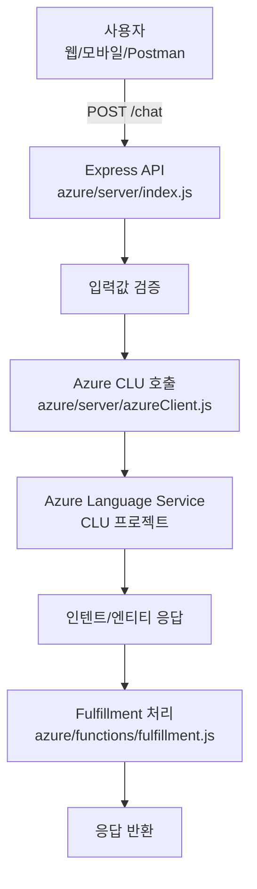

# MS Azure 기반 챗봇 실습 패키지 (학원 예약/상담 도메인)

AWS Lex V2 실습과 동일한 **학원 예약/상담 도메인**을 Microsoft Azure 서비스로 구현합니다.

---

## 아키텍처 개요



| AWS 서비스 | Azure 대응 서비스 |
|---|---|
| Amazon Lex V2 | Azure Language Service — CLU (Conversational Language Understanding) |
| AWS Lambda | Azure Functions (Node.js v4) |
| AWS CloudWatch | Azure Monitor / Application Insights |
| AWS IAM | Azure Managed Identity / Service Principal |

---

## 기술 스택

- **클라우드**: Microsoft Azure
- **NLU**: Azure Language Service — CLU (LUIS 후속)
- **서버리스**: Azure Functions v4 (Node.js)
- **런타임**: Node.js 18+
- **SDK**: `@azure/ai-language-conversations`, `@azure/core-auth`
- **API 서버**: Express

---

## 프로젝트 구조

```text
azure/
├─ README.md                     # 이 문서
├─ server/
│  ├─ index.js                   # Express API (/health, /chat)
│  ├─ azureClient.js             # Azure CLU analyzeConversation 래퍼
│  └─ package.json
└─ functions/
   └─ fulfillment.js             # Azure Functions + 인텐트 처리 로직
```

---

## 1) Azure Language Service 리소스 생성

### 1-1. Azure Portal에서 리소스 생성

```
Azure Portal → 리소스 만들기 → "Language Service" 검색 → 만들기
```

- **리소스 그룹**: `rg-lex-lab` (신규 생성)
- **이름**: `lang-lex-lab` (전역 고유명)
- **가격 책정 계층**: `F0` (무료, 학습용) 또는 `S` (표준)
- **지역**: `Korea Central` 또는 `East Asia`

### 1-2. 키 및 엔드포인트 확인

```
리소스 → [키 및 엔드포인트]
  - 엔드포인트: https://<your-resource>.cognitiveservices.azure.com
  - 키1 / 키2
```

---

## 2) CLU 프로젝트 생성 (Language Studio)

### 2-1. Language Studio 접속

```
https://language.cognitive.azure.com
```

→ 위에서 만든 Language 리소스 선택

### 2-2. 새 CLU 프로젝트 생성

```
[프로젝트 만들기] → [대화형 언어 이해] 선택
  - 프로젝트 이름: AcademyBot
  - 언어: Korean (ko)
  - 설명: 학원 예약/상담 챗봇
```

### 2-3. 인텐트 추가

`docs/azure-design.md` 의 설계표를 참고해 아래 인텐트를 추가합니다.

| 인텐트 | 목적 |
|---|---|
| MakeReservation | 수강 예약 생성 |
| CheckReservation | 예약 조회 |
| CancelReservation | 예약 취소 |
| CourseInfo | 과정/수업 정보 문의 |
| Help | 도움말/기능 안내 |
| None | 미인식 발화 (기본) |

### 2-4. 엔티티(Entity) 추가

AWS Lex의 Slot에 해당합니다.

| 엔티티 | 타입 | 예시 값 |
|---|---|---|
| Branch | List | 강남점, 홍대점, 잠실점, 분당점, 인천점 |
| CourseName | List | 토익, 오픽, 영어회화, 일본어, 자격증 |
| Date | Prebuilt (DateTime) | 2026-05-10, 다음 주 월요일 |
| Time | Prebuilt (DateTime) | 19:00, 오후 7시 |
| StudentName | Prebuilt (PersonName) | 김도영 |
| PhoneNumber | Regex | `\d{3}-\d{3,4}-\d{4}` |
| ReservationId | Regex | `R-[A-Z0-9]+` |

### 2-5. 학습 데이터(Utterance) 추가

`docs/utterances-100.md` 의 발화를 CLU 프로젝트에 입력합니다.  
각 발화에 인텐트와 엔티티를 레이블링합니다.

### 2-6. 학습(Train) 및 배포(Deploy)

```
[학습] → 학습 작업 이름 입력 → [학습 시작]
학습 완료 후 → [배포] → 배포 이름: production → [배포 추가]
```

---

## 3) 환경변수 설정

```bash
export AZURE_LANGUAGE_ENDPOINT="https://<your-resource>.cognitiveservices.azure.com"
export AZURE_LANGUAGE_KEY="<Key1-or-Key2>"
export AZURE_CLU_PROJECT="AcademyBot"
export AZURE_CLU_DEPLOYMENT="production"
```

---

## 4) 로컬 서버 실행

### 4-1. 의존성 설치

```bash
cd azure/server
npm install
```

### 4-2. 서버 시작

```bash
node index.js
```

- 기본 포트: `3100`
- 헬스체크: `GET http://localhost:3100/health`
- 챗 엔드포인트: `POST http://localhost:3100/chat`

### 4-3. API 호출 예시

```bash
curl -s http://localhost:3100/chat \
  -H 'Content-Type: application/json' \
  -d '{"text":"강남점 토익 예약하고 싶어요","sessionId":"demo-user-001"}' | jq .
```

응답 예시:

```json
{
  "intent": "MakeReservation",
  "score": 0.97,
  "entities": [
    { "name": "Branch",     "value": "강남점", "score": 0.99 },
    { "name": "CourseName", "value": "토익",   "score": 0.98 }
  ],
  "messages": ["예약 날짜를 알려주세요. (예: 2026-05-10)"],
  "sessionState": { "intent": "MakeReservation", "pendingBranch": "강남점", "pendingCourse": "토익" }
}
```

---

## 5) Azure Functions 배포

`azure/functions/fulfillment.js` 는 Express 서버의 인텐트 핸들러로도,  
Azure Functions HTTP 트리거로도 사용할 수 있습니다.

### 5-1. Azure Functions Core Tools 설치

```bash
npm install -g azure-functions-core-tools@4 --unsafe-perm true
```

### 5-2. Functions 프로젝트 초기화

```bash
mkdir -p /tmp/azure-func && cd /tmp/azure-func
func init --worker-runtime node --language javascript --model V4
mkdir src/functions
cp /path/to/azure/functions/fulfillment.js src/functions/
npm install @azure/functions
```

### 5-3. 로컬 테스트

```bash
func start
# POST http://localhost:7071/api/fulfillment
```

### 5-4. Azure에 배포

```bash
# Azure Function App 생성 (최초 1회)
az functionapp create \
  --resource-group rg-lex-lab \
  --consumption-plan-location koreacentral \
  --runtime node \
  --runtime-version 18 \
  --functions-version 4 \
  --name func-lex-lab \
  --storage-account <storage-name>

# 배포
func azure functionapp publish func-lex-lab
```

---

## 6) 필수 Azure 권한(RBAC)

| 역할 | 설명 |
|---|---|
| Cognitive Services Language Reader | CLU analyzeConversation 호출 |
| Cognitive Services User | Language 리소스 전반 |
| Contributor (Function App) | Functions 배포 |

로컬 개발 시에는 키 인증(`AZURE_LANGUAGE_KEY`)을 사용하고,  
프로덕션에서는 **Managed Identity** 사용을 권장합니다.

```bash
# Managed Identity 사용 시 azureClient.js의 credential을
# AzureKeyCredential → DefaultAzureCredential 로 교체
# npm install @azure/identity
```

---

## 7) AWS vs Azure 개념 비교

| 개념 | AWS | Azure |
|---|---|---|
| NLU 엔진 | Amazon Lex V2 | Azure CLU |
| 의도 | Intent | Intent |
| 입력값 | Slot (타입: AMAZON.Date 등) | Entity (Prebuilt/List/Regex) |
| 학습 발화 | Sample Utterance | Utterance |
| 배포 | Bot Alias | Deployment |
| 서버리스 | AWS Lambda | Azure Functions |
| 로그/모니터링 | CloudWatch | Azure Monitor / App Insights |
| 인증 | IAM Role / Access Key | Managed Identity / Service Principal |

---

## 8) 참고 링크

- [Azure Language Service 문서](https://learn.microsoft.com/azure/ai-services/language-service/)
- [CLU 빠른 시작](https://learn.microsoft.com/azure/ai-services/language-service/conversational-language-understanding/quickstart)
- [Azure Functions Node.js 개발자 가이드](https://learn.microsoft.com/azure/azure-functions/functions-reference-node)
- [Language Studio](https://language.cognitive.azure.com)
