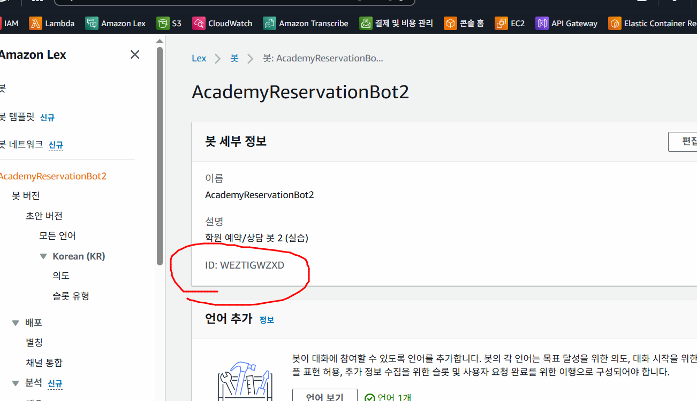

# Lex 자동 생성(Infra) 사용법

이 폴더에는 **Lex V2 봇을 자동 생성**하는 스크립트가 2가지 들어있습니다.

- `lex-bootstrap.sh` : AWS CLI 기반 (권장: 가장 단순/확실)
- `lex-bootstrap.js` : Node.js(AWS SDK v3) 기반

---

## 공통 준비
1) `infra/config.example.env` → `infra/config.env` 로 복사 후 값 설정

특히 아래 값은 반드시 확인하세요.

- `AWS_REGION`
- `BOT_NAME`
- `LOCALE_ID` (기본 `ko_KR`)
- `LAMBDA_ARN` (선택) : Fulfillment Lambda ARN

> `LAMBDA_ARN`을 비우면 Alias는 만들어지지만 **코드훅(Lambda)** 연결은 생략됩니다.

---

## 방법 A: AWS CLI (bash)
### 1) 의존성
- aws cli
- jq

### 2) 실행
```bash
bash infra/lex-bootstrap.sh
```

---


---
### BotID 는 있으나 오류일 경우
```
AWS_REGION=ap-northeast-2
BOT_ID=WEZTIGWZXD
while true; do
  s=$(aws --region $AWS_REGION lexv2-models describe-bot --bot-id "$BOT_ID" --query botStatus --output text)
  echo "botStatus=$s"
  [[ "$s" == "Available" ]] && break
  [[ "$s" == "Failed" ]] && { echo "Bot create failed"; exit 1; }
  sleep 5
done
```
### 위의 작업으로 botStatus=Available 상태 확인 후 다시 진행
---
```
export BOT_ID=WEZTIGWZXD
bash infra/lex-bootstrap.sh
```
### 수정 후 문법 체크
```
bash -n infra/lex-bootstrap.sh && echo "OK: syntax" || echo "NG"
```
### Locale 문제 발생 시
```
# WARNING: DRAFT Locale 삭제 -> 그 안의 intent/slot/slotType 전부 날아감
aws --region ap-northeast-2 lexv2-models delete-bot-locale \
  --bot-id "$BOT_ID" --bot-version DRAFT --locale-id ko_KR

# 다시 실행
bash infra/lex-bootstrap.sh
```

### 작업 지연 필요 시
```
root@DESKTOP-D6A344Q:/home/AI-AWS-Lex# BOT_ID=OFNMS2HLFJ
REGION=ap-northeast-2
while true; do
  S=$(aws --region $REGION lexv2-models describe-bot --bot-id $BOT_ID --query botStatus --output text)
  echo "botStatus=$S"
  [ "$S" = "Available" ] && break
  [ "$S" = "Failed" ] && { echo "Bot failed"; exit 1; }
  sleep 5
done
botStatus=Available
```
---

### 캐싱문제로 실행 안될 경우
```
FORCE_REFRESH_BUILTIN_CACHE=true bash infra/lex-bootstrap.sh
```

성공하면 출력에:
- `BOT_ID`
- `BOT_VERSION`
- `BOT_ALIAS_ID`
가 표시됩니다.

```
[9/9] 결과 요약
✅ 완료
- BOT_ID=OFNMS2HLFJ
- BOT_VERSION=3
- BOT_ALIAS_ID=F0AD9LP8EP
- LOCALE_ID=ko_KR

Node 서버에서 사용할 환경변수:
export AWS_REGION=ap-northeast-2
export LEX_BOT_ID=OFNMS2HLFJ
export LEX_BOT_ALIAS_ID=F0AD9LP8EP
export LEX_LOCALE_ID=ko_KR

(참고) ko_KR에서 Date/Time 전용 built-in이 없으면 AMAZON.AlphaNumeric로 수집됩니다.
→ CodeHook(Lambda)에서 정규화/검증 권장.'
```


---

## 방법 B: Node.js (AWS SDK v3) - js 로 만드는 예시로 미완성본
### 1) 의존성 설치
```bash
cd infra
npm i
```

### 2) 실행
```bash
node lex-bootstrap.js
```

---
---

## 실행 후 (서버 연동)
`server/`에서 아래 환경변수를 설정하고 실행하세요.

```bash
export AWS_REGION=ap-northeast-2
export LEX_BOT_ID=...
export LEX_BOT_ALIAS_ID=...
export LEX_LOCALE_ID=ko_KR
cd server
npm i
node index.js
```

---
```
aws --region ap-northeast-2 lexv2-models list-bot-aliases \
  --bot-id OFNMS2HLFJ \
  --query "botAliasSummaries[].{name:botAliasName,id:botAliasId,status:botAliasStatus,version:botVersion}" \
  --output table
```

```
export AWS_REGION=ap-northeast-2
export LEX_BOT_ID=OFNMS2HLFJ
export LEX_BOT_ALIAS_ID=F0AD9LP8EP
export LEX_LOCALE_ID=ko_KR
node index.js
```

```
aws --region ap-northeast-2 lambda list-functions \
  --query "Functions[].{name:FunctionName,arn:FunctionArn,runtime:Runtime}" \
  --output table
```

### 람다 생성
```
REGION=ap-northeast-2
FUNC_NAME=LexReservationFulfillment
ROLE_NAME=LexLambdaExecRole


rm -rf /tmp/lexlambda && mkdir -p /tmp/lexlambda
cp /home/AI-AWS-Lex/lambda/fulfillment.js /tmp/lexlambda/index.js
cd /tmp/lexlambda && zip -qr /tmp/lexlambda.zip .

# 4) Lambda 함수 생성(이미 있으면 업데이트)
aws --region $REGION lambda get-function --function-name $FUNC_NAME >/dev/null 2>&1 && \
aws --region $REGION lambda update-function-code --function-name $FUNC_NAME --zip-file fileb:///tmp/lexlambda.zip >/dev/null || \
aws --region $REGION lambda create-function \
  --function-name $FUNC_NAME \
  --runtime nodejs20.x \
  --handler index.handler \
  --role $ROLE_ARN \
  --zip-file fileb:///tmp/lexlambda.zip >/dev/null

LAMBDA_ARN=$(aws --region $REGION lambda get-function --function-name $FUNC_NAME --query 'Configuration.FunctionArn' --output text)
echo "LAMBDA_ARN=$LAMBDA_ARN"
```

### 람다 연결
```
REGION=ap-northeast-2
BOT_ID=OFNMS2HLFJ
ALIAS_NAME=DEV
LOCALE_ID=ko_KR
LAMBDA_ARN="arn:aws:lambda:ap-northeast-2:086015456585:function:LexReservationFulfillment"

ALIAS_ID=$(aws --region $REGION lexv2-models list-bot-aliases \
  --bot-id "$BOT_ID" \
  --query "botAliasSummaries[?botAliasName=='${ALIAS_NAME}'].botAliasId | [0]" --output text)

BOT_VERSION=$(aws --region $REGION lexv2-models list-bot-aliases \
  --bot-id "$BOT_ID" \
  --query "botAliasSummaries[?botAliasName=='${ALIAS_NAME}'].botVersion | [0]" --output text)

echo "ALIAS_ID=$ALIAS_ID"
echo "BOT_VERSION=$BOT_VERSION"

aws --region $REGION lexv2-models update-bot-alias \
  --bot-id "$BOT_ID" \
  --bot-alias-id "$ALIAS_ID" \
  --bot-alias-name "$ALIAS_NAME" \
  --bot-version "$BOT_VERSION" \
  --bot-alias-locale-settings "{
    \"${LOCALE_ID}\": {
      \"enabled\": true,
      \"codeHookSpecification\": {
        \"lambdaCodeHook\": {
          \"lambdaARN\": \"${LAMBDA_ARN}\",
          \"codeHookInterfaceVersion\": \"1.0\"
        }
      }
    }
  }"
```
---
### Lambda invoke permission 추가
```
REGION=ap-northeast-2
ACCOUNT_ID=086015456585
BOT_ID=OFNMS2HLFJ
ALIAS_ID=$(aws --region $REGION lexv2-models list-bot-aliases \
  --bot-id "$BOT_ID" \
  --query "botAliasSummaries[?botAliasName=='DEV'].botAliasId | [0]" --output text)

LAMBDA_ARN="arn:aws:lambda:ap-northeast-2:086015456585:function:LexReservationFulfillment"

aws --region $REGION lambda add-permission \
  --function-name "$LAMBDA_ARN" \
  --statement-id "LexInvokePermission-${BOT_ID}-${ALIAS_ID}" \
  --action lambda:InvokeFunction \
  --principal lexv2.amazonaws.com \
  --source-arn "arn:aws:lex:${REGION}:${ACCOUNT_ID}:bot-alias/${BOT_ID}/${ALIAS_ID}" \
  >/dev/null 2>&1 || true

```

### 결과 확인
```
aws --region ap-northeast-2 lexv2-models describe-bot-alias \
  --bot-id OFNMS2HLFJ \
  --bot-alias-id "$ALIAS_ID" \
  --query botAliasStatus --output text
```
---
```
root@DESKTOP-D6A344Q:/home/AI-AWS-Lex# aws --region ap-northeast-2 lexv2-models describe-bot-alias \
  --bot-id OFNMS2HLFJ \
  --bot-alias-id "$ALIAS_ID" \
  --query botAliasStatus --output text
Available
```

# 테스트:

```bash
curl -s http://localhost:3000/chat -H 'Content-Type: application/json' \
  -d '{"text":"강남점 토익 예약하고 싶어요","sessionId":"demo-user-001"}' | jq .
```
```
curl -s http://localhost:3000/chat -H 'Content-Type: application/json' \
  -d '{"text":"강남점","sessionId":"demo-user-001"}' | jq .
```
```
curl -s http://localhost:3000/chat -H 'Content-Type: application/json' \
  -d '{"text":"토익","sessionId":"demo-user-001"}' | jq .
```
```
curl -s http://localhost:3000/chat -H 'Content-Type: application/json' \
  -d '{"text":"2월 10일","sessionId":"demo-user-001"}' | jq .

curl -s http://localhost:3000/chat -H 'Content-Type: application/json' \
  -d '{"text":"19:30","sessionId":"demo-user-001"}' | jq .

curl -s http://localhost:3000/chat -H 'Content-Type: application/json' \
  -d '{"text":"김도영","sessionId":"demo-user-001"}' | jq .

curl -s http://localhost:3000/chat -H 'Content-Type: application/json' \
  -d '{"text":"010-1234-5678","sessionId":"demo-user-001"}' | jq .
```

---
### 람다 업데이트
```
REGION=ap-northeast-2
FUNC_NAME=LexReservationFulfillment

rm -rf /tmp/lexlambda /tmp/lexlambda.zip
mkdir -p /tmp/lexlambda

cat > /tmp/lexlambda/index.js <<'EOF'
function getSlotValue(slots, slotName) {
  const slot = slots?.[slotName];
  return slot?.value?.interpretedValue || slot?.value?.originalValue || null;
}

function responseClose(event, message, intentState = "Fulfilled", sessionAttributes) {
  return {
    sessionState: {
      sessionAttributes: sessionAttributes || event.sessionState?.sessionAttributes || {},
      dialogAction: { type: "Close" },
      intent: {
        ...event.sessionState.intent,
        state: intentState
      }
    },
    messages: [{ contentType: "PlainText", content: message }]
  };
}

exports.handler = async (event) => {
  const intentName = event.sessionState?.intent?.name;
  const slots = event.sessionState?.intent?.slots || {};
  const sessionAttrs = event.sessionState?.sessionAttributes || {};

  if (intentName === "MakeReservation") {
    const branch = getSlotValue(slots, "Branch");
    const course = getSlotValue(slots, "CourseName");
    const date = getSlotValue(slots, "Date");
    const time = getSlotValue(slots, "Time");
    const name = getSlotValue(slots, "StudentName");
    const phone = getSlotValue(slots, "PhoneNumber");

    const reservationId = `R-${Date.now().toString(36).toUpperCase()}`;
    const newSessionAttrs = {
      ...sessionAttrs,
      lastReservationId: reservationId,
      lastReservationSummary: JSON.stringify({ reservationId, branch, course, date, time, name, phone })
    };

    return responseClose(
      event,
      `예약 완료! 예약번호는 ${reservationId} 입니다. (${branch || "지점 미상"} / ${course || "과정 미상"} / ${date || "날짜 미상"} ${time || ""})`,
      "Fulfilled",
      newSessionAttrs
    );
  }

  if (intentName === "CancelReservation") {
    const reservationId = getSlotValue(slots, "ReservationId") || sessionAttrs.lastReservationId;
    if (!reservationId) return responseClose(event, "취소할 예약번호를 찾지 못했어요. 예약번호를 알려주세요.", "Failed", sessionAttrs);

    const newSessionAttrs = { ...sessionAttrs, lastCancelledReservationId: reservationId };
    return responseClose(event, `예약(${reservationId}) 취소가 완료됐어요.`, "Fulfilled", newSessionAttrs);
  }

  if (intentName === "CheckReservation") {
    const reservationId = getSlotValue(slots, "ReservationId") || sessionAttrs.lastReservationId;
    if (!reservationId) return responseClose(event, "조회할 예약번호를 찾지 못했어요. 예약번호를 알려주세요.", "Failed", sessionAttrs);

    const summaryRaw = sessionAttrs.lastReservationSummary;
    if (summaryRaw) {
      try {
        const summary = JSON.parse(summaryRaw);
        if (summary.reservationId === reservationId) {
          return responseClose(
            event,
            `예약 조회: ${summary.branch || "지점"} / ${summary.course || "과정"} / ${summary.date || ""} ${summary.time || ""} (예약번호 ${reservationId})`,
            "Fulfilled",
            sessionAttrs
          );
        }
      } catch (e) {}
    }
    return responseClose(event, `예약번호 ${reservationId} 로 등록된 예약을 찾지 못했어요(데모 환경).`, "Fulfilled", sessionAttrs);
  }

  if (intentName === "CourseInfo") {
    const course = getSlotValue(slots, "CourseName");
    if (!course) return responseClose(event, "어떤 과정이 궁금하세요? 예: 토익, 회화, 자격증", "Fulfilled", sessionAttrs);
    return responseClose(event, `${course} 과정은 주 2회/주 3회 선택 가능하고, 레벨 테스트 후 반 편성이 진행돼요(데모 안내).`, "Fulfilled", sessionAttrs);
  }

  if (intentName === "Help") {
    return responseClose(event, "가능한 기능: 수강 상담 예약, 예약 조회/취소. 예) '강남점 토익 예약하고 싶어'", "Fulfilled", sessionAttrs);
  }

  return responseClose(event, "죄송해요, 잘 이해하지 못했어요. '예약', '조회', '취소', '과정 안내' 중으로 다시 말씀해 주세요.", "Fulfilled", sessionAttrs);
};
EOF

cd /tmp/lexlambda
zip -qr /tmp/lexlambda.zip .

aws --region $REGION lambda update-function-code \
  --function-name $FUNC_NAME \
  --zip-file fileb:///tmp/lexlambda.zip \
  >/dev/null

echo "✅ Lambda updated: $FUNC_NAME"
```