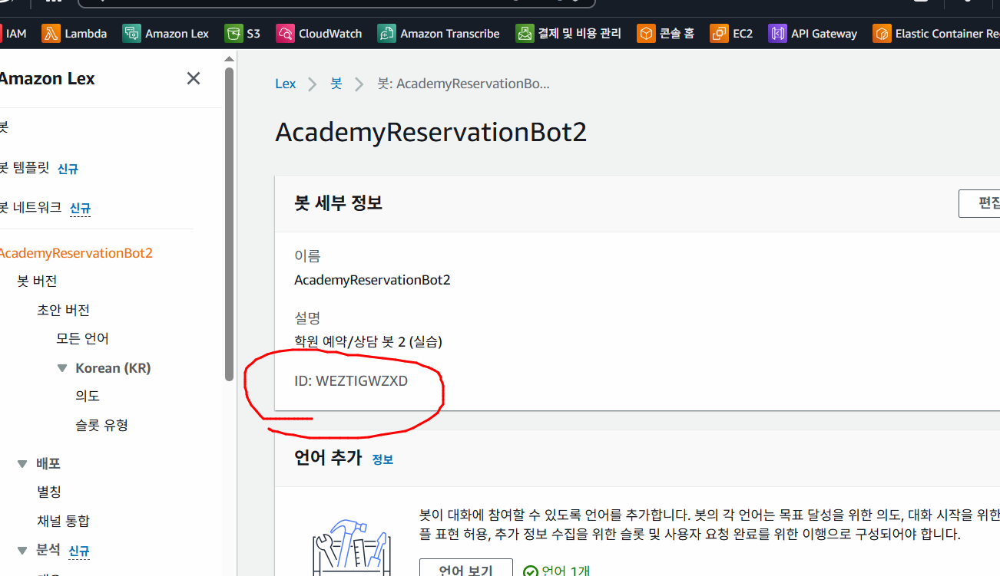

# Lex 자동 생성(Infra) 사용법

이 폴더에는 **Lex V2 봇을 자동 생성**하는 스크립트가 2가지 들어있습니다.

- `lex-bootstrap.sh` : AWS CLI 기반 bash 스크립트
- `lex-bootstrap.py` : AWS CLI 기반 Python 스크립트 (권장)
- `lex-bootstrap.js` : Node.js(AWS SDK v3) 기반

---

## 공통 준비
1) `infra/config.example.env` → `infra/config.env` 로 복사 후 값 설정

특히 아래 값은 반드시 확인하세요.

- `AWS_REGION`
- `BOT_NAME`
- `LOCALE_ID` (기본 `ko_KR`)
- `LAMBDA_ARN` (선택) : Fulfillment Lambda ARN

> `LAMBDA_ARN`을 비우면 Alias는 만들어지지만 **코드훅(Lambda)** 연결은 생략됩니다.

---

## 방법 A: AWS CLI (Python, 권장)
### 1) 의존성
- aws cli
- python 3.9+

### 2) 실행
```bash
python3 infra/lex-bootstrap.py
```

---

## 방법 B: AWS CLI (bash)
### 1) 의존성
- aws cli
- jq

### 2) 실행
```bash
bash infra/lex-bootstrap.sh
```

---


---
### BotID 는 있으나 오류일 경우
```
AWS_REGION=ap-northeast-2
BOT_ID=WEZTIGWZXD
while true; do
  s=$(aws --region $AWS_REGION lexv2-models describe-bot --bot-id "$BOT_ID" --query botStatus --output text)
  echo "botStatus=$s"
  [[ "$s" == "Available" ]] && break
  [[ "$s" == "Failed" ]] && { echo "Bot create failed"; exit 1; }
  sleep 5
done
```
### 위의 작업으로 botStatus=Available 상태 확인 후 다시 진행
---
```
export BOT_ID=WEZTIGWZXD
bash infra/lex-bootstrap.sh
```
### 수정 후 문법 체크
```
bash -n infra/lex-bootstrap.sh && echo "OK: syntax" || echo "NG"
```
### Locale 문제 발생 시
```
# WARNING: DRAFT Locale 삭제 -> 그 안의 intent/slot/slotType 전부 날아감
aws --region ap-northeast-2 lexv2-models delete-bot-locale \
  --bot-id "$BOT_ID" --bot-version DRAFT --locale-id ko_KR

# 다시 실행
bash infra/lex-bootstrap.sh
```

### 작업 지연 필요 시
```
root@DESKTOP-D6A344Q:/home/AI-AWS-Lex# BOT_ID=38N5QKAZMD
REGION=ap-northeast-2
while true; do
  S=$(aws --region $REGION lexv2-models describe-bot --bot-id $BOT_ID --query botStatus --output text)
  echo "botStatus=$S"
  [ "$S" = "Available" ] && break
  [ "$S" = "Failed" ] && { echo "Bot failed"; exit 1; }
  sleep 5
done
botStatus=Available
```
---

### 캐싱문제로 실행 안될 경우
```
FORCE_REFRESH_BUILTIN_CACHE=true bash infra/lex-bootstrap.sh
```

성공하면 출력에:
- `BOT_ID`
- `BOT_VERSION`
- `BOT_ALIAS_ID`
가 표시됩니다.

```
[9/9] 결과 요약
✅ 완료
- BOT_ID=38N5QKAZMD
- BOT_VERSION=3
- BOT_ALIAS_ID=F0AD9LP8EP
- LOCALE_ID=ko_KR

Node 서버에서 사용할 환경변수:
export AWS_REGION=ap-northeast-2
export LEX_BOT_ID=38N5QKAZMD
export LEX_BOT_ALIAS_ID=F0AD9LP8EP
export LEX_LOCALE_ID=ko_KR

(참고) ko_KR에서 Date/Time 전용 built-in이 없으면 AMAZON.AlphaNumeric로 수집됩니다.
→ CodeHook(Lambda)에서 정규화/검증 권장.'
```


---

## 방법 C: Node.js (AWS SDK v3) - js 로 만드는 예시로 미완성본
### 1) 의존성 설치
```bash
cd infra
npm i
```

### 2) 실행
```bash
node lex-bootstrap.js
```

---
---

## 실행 후 (서버 연동)
`server/`에서 아래 환경변수를 설정하고 실행하세요.

```bash
export AWS_REGION=ap-northeast-2
export LEX_BOT_ID=...
export LEX_BOT_ALIAS_ID=...
export LEX_LOCALE_ID=ko_KR
cd server
npm i
node index.js
```

---
```
aws --region ap-northeast-2 lexv2-models list-bot-aliases \
  --bot-id 38N5QKAZMD \
  --query "botAliasSummaries[].{name:botAliasName,id:botAliasId,status:botAliasStatus,version:botVersion}" \
  --output table
```

```
export AWS_REGION=ap-northeast-2
export LEX_BOT_ID=38N5QKAZMD
export LEX_BOT_ALIAS_ID=F0AD9LP8EP
export LEX_LOCALE_ID=ko_KR
node index.js
```

```
aws --region ap-northeast-2 lambda list-functions \
  --query "Functions[].{name:FunctionName,arn:FunctionArn,runtime:Runtime}" \
  --output table
```

### 람다 생성
```
REGION=ap-northeast-2
FUNC_NAME=LexReservationFulfillment
ROLE_NAME=LexLambdaExecRole
rm -rf /tmp/lexlambda && mkdir -p /tmp/lexlambda
cp /home/AI-AWS-Lex/lambda/fulfillment.js /tmp/lexlambda/index.js
cd /tmp/lexlambda && zip -qr /tmp/lexlambda.zip .
```
---

# 4) Lambda 함수 생성(이미 있으면 업데이트)
```
aws --region $REGION lambda get-function --function-name $FUNC_NAME >/dev/null 2>&1 && \
```
---
```
aws --region $REGION lambda update-function-code --function-name $FUNC_NAME --zip-file fileb:///tmp/lexlambda.zip >/dev/null || \
```

### arn:aws:iam::086015456585:role/LexLabServiceRole

---
```
aws --region $REGION lambda create-function \
  --function-name $FUNC_NAME \
  --runtime nodejs20.x \
  --handler index.handler \
  --role arn:aws:iam::086015456585:role/LexLabServiceRole \
  --zip-file fileb:///tmp/lexlambda.zip >/dev/null

LAMBDA_ARN=$(aws --region $REGION lambda get-function --function-name $FUNC_NAME --query 'Configuration.FunctionArn' --output text)
echo "LAMBDA_ARN=$LAMBDA_ARN"
```

### 람다 연결
```
REGION=ap-northeast-2
BOT_ID=38N5QKAZMD
ALIAS_NAME=DEV
LOCALE_ID=ko_KR
LAMBDA_ARN="arn:aws:lambda:ap-northeast-2:086015456585:function:LexReservationFulfillment"

ALIAS_ID=$(aws --region $REGION lexv2-models list-bot-aliases \
  --bot-id "$BOT_ID" \
  --query "botAliasSummaries[?botAliasName=='${ALIAS_NAME}'].botAliasId | [0]" --output text)

BOT_VERSION=$(aws --region $REGION lexv2-models list-bot-aliases \
  --bot-id "$BOT_ID" \
  --query "botAliasSummaries[?botAliasName=='${ALIAS_NAME}'].botVersion | [0]" --output text)

echo "ALIAS_ID=$ALIAS_ID"
echo "BOT_VERSION=$BOT_VERSION"

aws --region $REGION lexv2-models update-bot-alias \
  --bot-id "$BOT_ID" \
  --bot-alias-id "$ALIAS_ID" \
  --bot-alias-name "$ALIAS_NAME" \
  --bot-version "$BOT_VERSION" \
  --bot-alias-locale-settings "{
    \"${LOCALE_ID}\": {
      \"enabled\": true,
      \"codeHookSpecification\": {
        \"lambdaCodeHook\": {
          \"lambdaARN\": \"${LAMBDA_ARN}\",
          \"codeHookInterfaceVersion\": \"1.0\"
        }
      }
    }
  }"
```
---
### Lambda invoke permission 추가
```
REGION=ap-northeast-2
ACCOUNT_ID=086015456585
BOT_ID=38N5QKAZMD
ALIAS_ID=$(aws --region $REGION lexv2-models list-bot-aliases \
  --bot-id "$BOT_ID" \
  --query "botAliasSummaries[?botAliasName=='DEV'].botAliasId | [0]" --output text)

LAMBDA_ARN="arn:aws:lambda:ap-northeast-2:086015456585:function:LexReservationFulfillment"

aws --region $REGION lambda add-permission \
  --function-name "$LAMBDA_ARN" \
  --statement-id "LexInvokePermission-${BOT_ID}-${ALIAS_ID}" \
  --action lambda:InvokeFunction \
  --principal lexv2.amazonaws.com \
  --source-arn "arn:aws:lex:${REGION}:${ACCOUNT_ID}:bot-alias/${BOT_ID}/${ALIAS_ID}" \
  >/dev/null 2>&1 || true

```

### 결과 확인
```
aws --region ap-northeast-2 lexv2-models describe-bot-alias \
  --bot-id 38N5QKAZMD \
  --bot-alias-id "$ALIAS_ID" \
  --query botAliasStatus --output text
```

# 테스트:

```bash
curl -s http://localhost:3000/api/chat \
  -H 'Content-Type: application/json' \
  -d '{"text":"강남점 토익 예약하고 싶어요","sessionId":"demo-user-001"}' | jq .
```

---
```
root@DESKTOP-OJOTK17:/home/AI-AWS-Lex# curl -s http://localhost:3000/api/chat \
  -H 'Content-Type: application/json' \
  -d '{"text":"강남점 토익 예약하고 싶어요","sessionId":"demo-user-001"}' | jq .
{
  "error": "Lambda 호출 실패: {\"errorType\":\"TypeError\",\"errorMessage\":\"Cannot read properties of undefined (reading 'intent')\",\"trace\":[\"TypeError: Cannot read properties of undefined (reading 'intent')\",\"    at close (/var/task/index.js:23:31)\",\"    at exports.handler (/var/task/index.js:123:10)\",\"    at Runtime.handleOnceNonStreaming (file:///var/runtime/index.mjs:1306:29)\"]}",
  "hint": "AWS_REGION / LEX_BOT_ID / LEX_BOT_ALIAS_ID / (옵션) LEX_LOCALE_ID 환경변수와 AWS 자격증명 설정을 확인하세요."
```

---
### 람다 업데이트
```
REGION=ap-northeast-2
FUNC_NAME=LexReservationFulfillment

rm -rf /tmp/lexlambda /tmp/lexlambda.zip
mkdir -p /tmp/lexlambda

cp /home/ubuntu/chatbot-app/lambda/fulfillment.js /tmp/lexlambda/index.js

cd /tmp/lexlambda
zip -qr /tmp/lexlambda.zip .

aws --region $REGION lambda update-function-code \
  --function-name $FUNC_NAME \
  --zip-file fileb:///tmp/lexlambda.zip \
  >/dev/null

echo "✅ Lambda updated: $FUNC_NAME"
```
