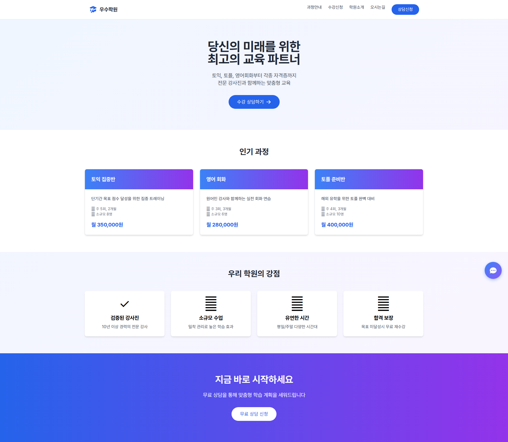
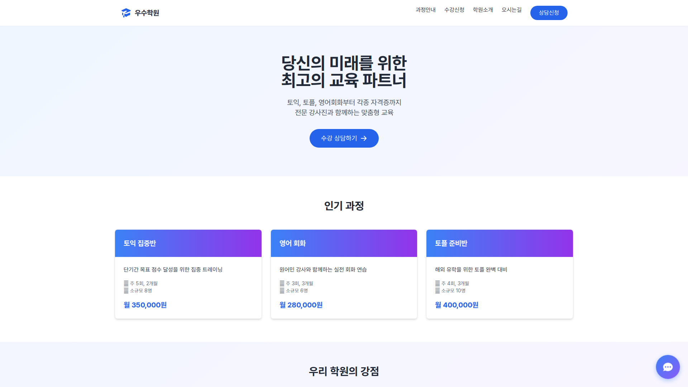

# Lex Chat UX v3 (Quasar Framework + Vue 3)

Amazon Lex V2 Runtime 호출 + "대화형 UX" 렌더링 예제입니다.

**🎨 Quasar Framework 기반으로 완전히 재구성됨**
- 학원 홈페이지 메인 화면
- 우측 하단 플로팅 챗봇 버튼
- 모달 형태의 대화형 챗봇 인터페이스
- Tailwind CSS + Pretendard 폰트 적용
- 반응형 디자인 (모바일/태블릿/데스크톱 지원)

## 스크린샷

### 홈페이지 메인 화면


### 챗봇 버튼이 있는 홈페이지


## 주요 UX 기능
- 슬롯별 추천 버튼(Quick Replies) 자동 생성  
  - `.env`의 `BRANCH_VALUES`, `COURSE_VALUES`를 사용하거나  
  - (권한이 있으면) Lex Models API로 Bot의 SlotType(enum) 값을 읽어와 자동 생성
- "현재까지 채운 값" 요약 카드(Branch/Course/Date/Time/Name/Phone)
- 슬롯 타입에 따라 입력 폼 UX 변경  
  - Date: date 입력 UI  
  - Time: time 입력 UI  
  - PhoneNumber: 전화번호 마스킹(010-1234-5678)
- 대화 기록(localStorage) 저장/복원 + 세션 유지
- **AI 엔진 선택 기능(사내 업무용)**
  - AWS Lex (managed)
  - Ollama (Docker on-prem)
  - OpenAI-compatible endpoint(vLLM/TGI 등, Docker on-prem)

## 사내 업무용 AI 엔진 추천 (on-prem/Docker)
- **1순위: Ollama + Llama/Qwen Instruct 모델**
  - 장점: 설치/운영 단순, POC 빠름, 내부망 구성 쉬움
  - 권장: 일반 Q&A, 사내 지식검색 연계 전 단계
- **2순위: vLLM(OpenAI-compatible) + Qwen/Llama Instruct**
  - 장점: 동시성/처리량 우수, OpenAI API 호환으로 FE/BE 연동 쉬움
  - 권장: 다수 사용자 대상 사내 챗봇 서비스
- **기존 예약/슬롯형 시나리오는 AWS Lex 유지**
  - 장점: 의도/슬롯/대화상태 관리가 안정적

## 기술 스택
- **Frontend**: Vue 3 + Quasar Framework
- **Styling**: Tailwind CSS + Pretendard Font
- **State Management**: Pinia
- **Backend**: Express.js + AWS SDK
- **HTTP Client**: Axios

## 설치/실행
```bash
# 환경변수 설정
cp infra/config.example.env infra/config.env
# AWS_REGION, LEX_BOT_ID, LEX_BOT_ALIAS_ID, LEX_LOCALE_ID 설정
# (옵션) BRANCH_VALUES, COURSE_VALUES 설정
# (옵션) DEFAULT_AI_ENGINE, ENABLED_AI_ENGINES 및 on-prem 엔드포인트 설정

# 의존성 설치
npm install

# 개발 모드 실행 (Quasar Dev + API Server 동시 실행)
npm run dev

# 프로덕션 빌드
npm run build

# API 서버만 실행
npm run server
```

### 개발 환경 포트
- **Frontend (Quasar)**: http://localhost:9000
- **API Server (Express)**: http://localhost:3000

프로덕션에서는 `/api/*` 요청이 Express 서버로 프록시됩니다.

## 프로젝트 구조
```
lex-chat-ux/
├── src/
│   ├── components/          # Vue 컴포넌트
│   │   ├── ChatbotButton.vue   # 플로팅 챗봇 버튼
│   │   └── ChatbotDialog.vue   # 챗봇 대화 모달
│   ├── pages/               # 페이지 컴포넌트
│   │   └── HomePage.vue        # 학원 홈페이지
│   ├── stores/              # Pinia 스토어
│   │   └── chatStore.js        # 챗봇 상태 관리
│   ├── router/              # Vue Router
│   ├── boot/                # Quasar 부트 파일
│   └── css/                 # 스타일시트
├── server/                  # Express API 서버
│   ├── index.js
│   ├── lexClient.js
│   ├── lambdaClient.js
│   └── ...
├── public/                  # 정적 파일 (레거시)
├── screenshots/             # UI 스크린샷
├── quasar.config.js         # Quasar 설정
├── tailwind.config.js       # Tailwind 설정
└── package.json
```

## API
- POST `/api/chat` : 선택 엔진으로 대화 처리 (`engine` 파라미터 지원)
- GET  `/api/suggestions?slot=Branch|CourseName` : quick replies 후보 목록
- GET  `/api/engines` : FE 엔진 셀렉터용 목록

### `/api/chat` 요청 예시
```json
{
  "text": "사내 공지 요약해줘",
  "sessionId": "web-abc",
  "engine": "ollama"
}
```

### 환경변수 예시
```env
DEFAULT_AI_ENGINE=aws-lex
ENABLED_AI_ENGINES=aws-lex,ollama,openai-compatible

OLLAMA_BASE_URL=http://localhost:11434
OLLAMA_MODEL=llama3.1:8b

OPENAI_COMPAT_BASE_URL=http://localhost:8000
OPENAI_COMPAT_MODEL=qwen2.5-7b-instruct
OPENAI_COMPAT_API_KEY=dummy
```
