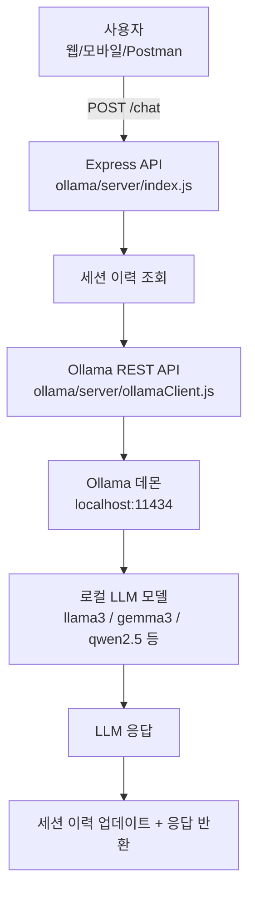

# Ollama 온프렘 LLM 챗봇 실습 패키지 (학원 예약/상담 도메인)

**Ollama**를 온프렘(On-Premises) 환경에서 실행해 AWS Lex V2 / Azure CLU 없이도  
동일한 학원 예약/상담 도메인 챗봇을 구현합니다.

---

## 아키텍처 개요



> **Ollama**는 클라우드 API 없이 로컬 머신(온프렘 서버, 개발자 PC)에서  
> 오픈소스 LLM을 실행할 수 있는 런타임입니다.

---

## AWS Lex vs Ollama 비교

| 항목 | AWS Lex V2 | Ollama (온프렘) |
|---|---|---|
| NLU 방식 | 인텐트/슬롯 기반 (의도 분류) | LLM 자연어 이해 (생성형) |
| 학습 데이터 | Sample Utterance 입력 필요 | 시스템 프롬프트로 역할 지정 |
| 대화 상태 | Lex가 슬롯 수집 흐름 관리 | 대화 이력(messages) 직접 관리 |
| 비용 | 요청 수 기반 과금 | 서버 자체 비용 (GPU/CPU) |
| 인터넷 연결 | 필요 | 불필요 (완전 온프렘) |
| 데이터 프라이버시 | AWS 클라우드 전송 | 외부 전송 없음 |
| 설정 난이도 | 중간 (콘솔/스크립트) | 낮음 (올라마 설치 후 즉시) |

---

## 기술 스택

- **LLM 런타임**: [Ollama](https://ollama.ai)
- **모델 예시**: llama3, gemma3, qwen2.5, exaone3.5(한국어 특화)
- **API 서버**: Express (Node.js 18+)
- **외부 의존성**: 없음 (Node.js 내장 `http` 모듈로 Ollama REST API 호출)

---

## 프로젝트 구조

```text
ollama/
├─ README.md                     # 이 문서
└─ server/
   ├─ index.js                   # Express API (/health, /chat, DELETE /session/:id)
   ├─ ollamaClient.js            # Ollama /api/chat 래퍼 + ping
   └─ package.json
```

---

## 1) Ollama 설치 및 모델 준비

### 1-1. Ollama 설치

**Linux (온프렘 서버 권장)**:

```bash
curl -fsSL https://ollama.ai/install.sh | sh
```

**macOS**:

```bash
brew install ollama
```

**Windows**:

```
https://ollama.ai/download 에서 설치 파일 다운로드
```

### 1-2. Ollama 서비스 시작

```bash
# 포그라운드 실행
ollama serve

# 백그라운드(systemd) - Linux 서버 환경
sudo systemctl enable ollama
sudo systemctl start ollama
```

기본 포트: `11434`

### 1-3. 모델 다운로드

```bash
# 범용 (영/한 혼합)
ollama pull llama3

# 한국어 지원 강화
ollama pull gemma3          # Google Gemma3
ollama pull qwen2.5         # Alibaba Qwen2.5 (한국어 우수)
ollama pull exaone3.5       # LG AI Research 한국어 특화 (권장)

# 경량 모델 (저사양 서버)
ollama pull gemma3:1b
ollama pull qwen2.5:3b
```

### 1-4. 설치 확인

```bash
ollama list                  # 다운로드된 모델 목록
ollama run llama3 "안녕"    # 빠른 테스트
```

---

## 2) 환경변수 설정

```bash
export OLLAMA_BASE_URL="http://localhost:11434"   # 기본값, 원격 서버이면 변경
export OLLAMA_MODEL="exaone3.5"                    # 사용할 모델명
```

> **원격 Ollama 서버** 연결 시 `OLLAMA_BASE_URL=http://<server-ip>:11434` 로 변경합니다.

---

## 3) 로컬 서버 실행

### 3-1. 의존성 설치

```bash
cd ollama/server
npm install
```

### 3-2. 서버 시작

```bash
node index.js
```

- 기본 포트: `3200`
- 헬스체크: `GET http://localhost:3200/health`
- 챗 엔드포인트: `POST http://localhost:3200/chat`
- 세션 초기화: `DELETE http://localhost:3200/session/:sessionId`

---

## 4) API 사용 예시

### 4-1. 헬스체크

```bash
curl -s http://localhost:3200/health | jq .
```

응답:

```json
{
  "ok": true,
  "platform": "ollama",
  "model": "exaone3.5",
  "ollamaUrl": "http://localhost:11434"
}
```

### 4-2. 챗

```bash
# 첫 번째 메시지
curl -s http://localhost:3200/chat \
  -H 'Content-Type: application/json' \
  -d '{"text":"강남점 토익 예약하고 싶어요","sessionId":"demo-user-001"}' | jq .

# 두 번째 메시지 (대화 이력 유지)
curl -s http://localhost:3200/chat \
  -H 'Content-Type: application/json' \
  -d '{"text":"2026-05-15 오후 7시로 해주세요","sessionId":"demo-user-001"}' | jq .
```

응답 예시:

```json
{
  "messages": ["안녕하세요! 예약 도와드릴게요. 성함과 연락처를 알려주세요."],
  "sessionId": "demo-user-001",
  "model": "exaone3.5",
  "historyLength": 4
}
```

### 4-3. 세션 초기화

```bash
curl -s -X DELETE http://localhost:3200/session/demo-user-001 | jq .
```

---

## 5) 시스템 프롬프트 커스터마이징

`ollama/server/ollamaClient.js` 의 `SYSTEM_PROMPT` 상수를 수정하면  
봇의 역할, 지점 목록, 과정 목록, 응답 스타일을 조정할 수 있습니다.

```js
const SYSTEM_PROMPT = `당신은 어학원 예약/상담 전문 AI 어시스턴트입니다.
...
`;
```

---

## 6) 온프렘 배포 고려사항

### GPU 권장 사양

| 모델 크기 | 권장 GPU VRAM | 권장 RAM |
|---|---|---|
| 1B ~ 3B (경량) | 4GB | 8GB |
| 7B ~ 8B (일반) | 8GB | 16GB |
| 13B ~ 14B | 16GB | 32GB |
| 70B+ (대형) | 40GB+ (A100 등) | 64GB+ |

CPU 전용 실행도 가능하지만 응답 속도가 느릴 수 있습니다.

### Ollama 원격 접근 허용

외부 서버에서 Ollama를 실행하고 다른 머신에서 접근할 경우:

```bash
# /etc/systemd/system/ollama.service.d/override.conf 에 추가
[Service]
Environment="OLLAMA_HOST=0.0.0.0:11434"

sudo systemctl daemon-reload
sudo systemctl restart ollama
```

방화벽: `11434` 포트 개방 (내부망 한정 권장)

### Docker로 실행 (GPU 없는 환경)

```bash
# CPU 전용
docker run -d -v ollama:/root/.ollama -p 11434:11434 --name ollama ollama/ollama

# NVIDIA GPU 사용
docker run -d --gpus=all -v ollama:/root/.ollama -p 11434:11434 --name ollama ollama/ollama
```

---

## 7) 세 플랫폼 비교 요약

| 항목 | AWS Lex V2 | Azure CLU | Ollama (온프렘) |
|---|---|---|---|
| 서버 위치 | AWS 클라우드 | Azure 클라우드 | 온프렘 / 사내 서버 |
| 인터넷 필요 | 필요 | 필요 | 불필요 |
| 비용 모델 | 요청 수 과금 | 요청 수 과금 | 서버 비용 고정 |
| 데이터 외부 전송 | O | O | X (완전 로컬) |
| 설정 복잡도 | 중 | 중 | 낮음 |
| 한국어 지원 | ko_KR 로케일 | 한국어 CLU 프로젝트 | 모델에 따라 다름 |
| NLU 방식 | 인텐트/슬롯 | 인텐트/엔티티 | LLM 자연어 이해 |
| 학습 필요 | O (발화 입력) | O (발화 입력) | X (프롬프트만) |

---

## 8) 참고 링크

- [Ollama 공식 사이트](https://ollama.ai)
- [Ollama GitHub](https://github.com/ollama/ollama)
- [Ollama REST API 명세](https://github.com/ollama/ollama/blob/main/docs/api.md)
- [한국어 지원 모델 목록](https://ollama.ai/library)
- [EXAONE 3.5 (LG AI Research)](https://ollama.ai/library/exaone3.5)
